## SE 452

## Overview

This project aims to create a robust object-oriented system for managing hotel data. It provides a structured framework for organizing information related to hotels, rooms, guests, reservations, and more. By utilizing object-oriented principles, the codebase ensures flexibility, scalability, and maintainability.

# Milestones

*Milestone 1: Establish project parameters, outline structural framework, and allocate specific responsibilities to team members. 
*Milestone 2: Establish project data storage and initial service implementation for each module. 
*Milestone 3: Enhance tables as per evolving needs, integrate Swagger documentation, Git-hub workflow for pushing image into docker hub and develop customized services. 
*Milestone 4: Implemented front end using themeleaf, integrated both front and back end. Updating Docker image for every push.

# Features
Hotel Class: Represents a hotel with attributes such as name, address, contact information, and a collection of rooms.

Room Class: Defines individual rooms within a hotel, including room number, type (single, double, suite, etc.), availability status, and pricing information.

Guest Class: Represents guests staying at the hotel, with attributes like name, contact details, and possibly membership information.

Reservation Class: Manages reservations made by guests, including check-in/out dates, room allocation, guest information, and billing details.

Payment Class: Manages payment transactions made by guests, including payment dates, amounts, methods, and associated booking details.

Booking Class: Handles guest bookings, storing information such as check-in and check-out dates, room details, and payment amounts.

# Setup Instructions
Clone the Repository: Start by cloning the repository to your local machine:
...
# Usage
To use the hotel data project:
...

 
* Milestone 1: Establish the project, outline its structure, and assign specific areas of responsibility to each team member 

## Project Members

| Member           | Feature          | Note                                                                                                                                              |
|------------------|------------------|-----|
| Cameron Laviste  | JUnit            | hotel service junit testing   |
| Jerry Tang       | Front End        | Setting up website HTML   |
| Jon Doretti      | -                | -   |
| Vinod Kotapati   | Payment, Booking | The Booking table manages guest bookings, while the Payment table records payment transactions made by guests)  [Link to package-info.java](https://github.com/CamLav24/SE352-Group1/blob/master/src/main/java/cdm/depaul/edu/se352/group1/se352group1/booking/package-info.java) |
| Shihua Zhang     | Front End        | setting up front end sorting functions / feature   |

 

## Communication Mechanism

Will meet using Discord and Zoom.

 

## Conflict Resolution

First we vote, and then roll dice.

## Meeting Notes

| #   | Date      | Note                                                                             | Participants |
|-----|-----------|----------------------------------------------------------------------------------|--------------|
| 1   | 4-4-2024  | We decided our project scope and setup env.                                      | All          |
 | 2   | 4-25-2024 | Created Basic project and Divided the inital features.                           | All          |

 

## Decision Made

| #   | Area                  | Decision     | Alternative | Rationale                                                             |
|-----|-----------------------|--------------|-------------|-----------------------------------------------------------------------|
| 1   | IDE                   | IntelliJ IDEA | VS Code     | Language independent editor so that it can be used in non java course |
| 2   | Dependency Management | Maven        | Gradle      | familiarity                                                           |
| 3   | Configurations        | Application properties           | YML         | Liked this approach                                                   |
| 4   | Database              | H2            | Docker           | Will update according to requirement.                                 |

## Appendix

Working code (Milestone 1):

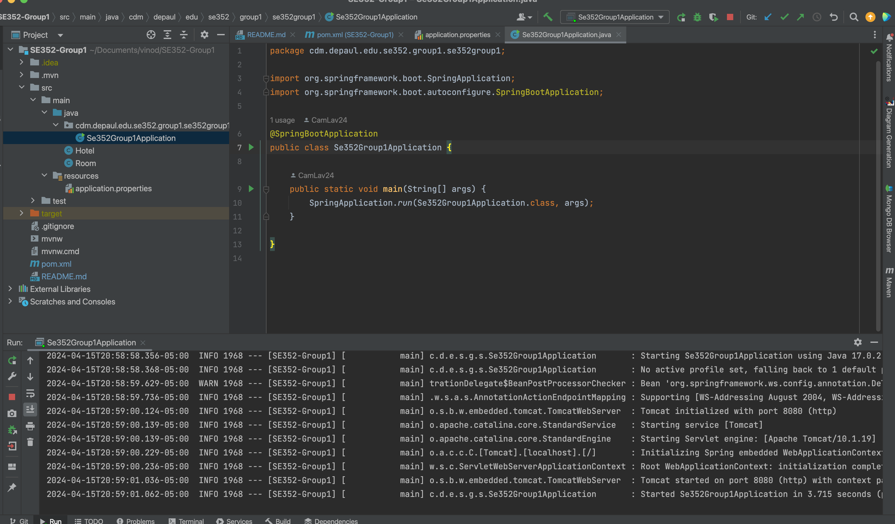

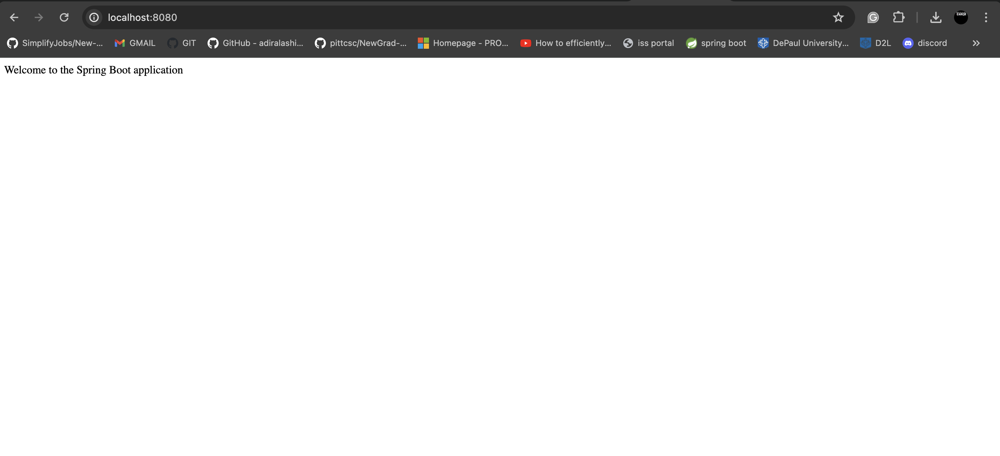

Working code (Milestone 2):

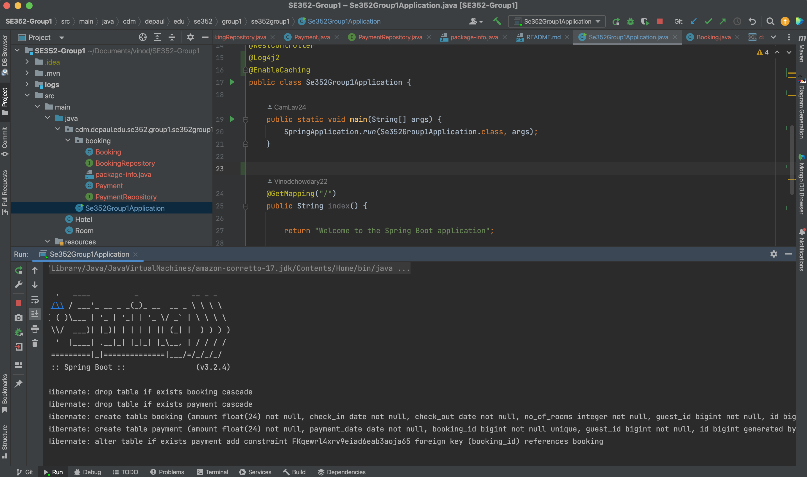

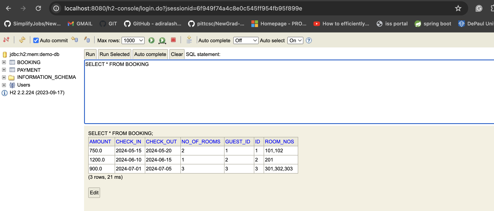

Working code (Milestone 3):

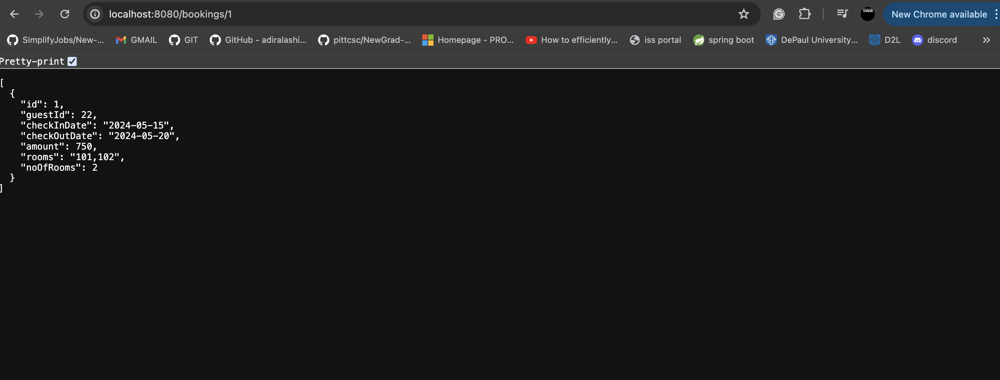

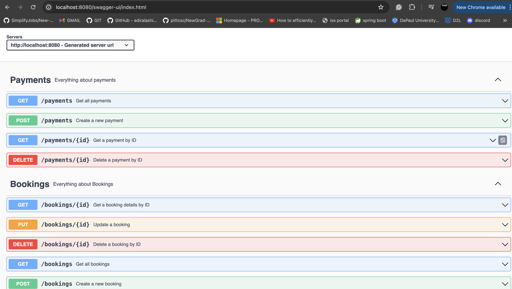

Before sorting:

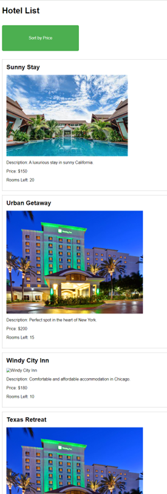

After sorting (in prize ascending order):

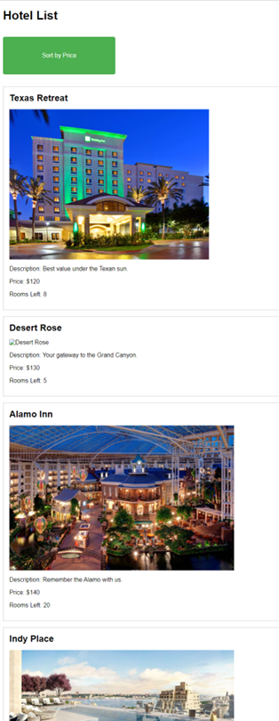

Working code (Milestone 4):

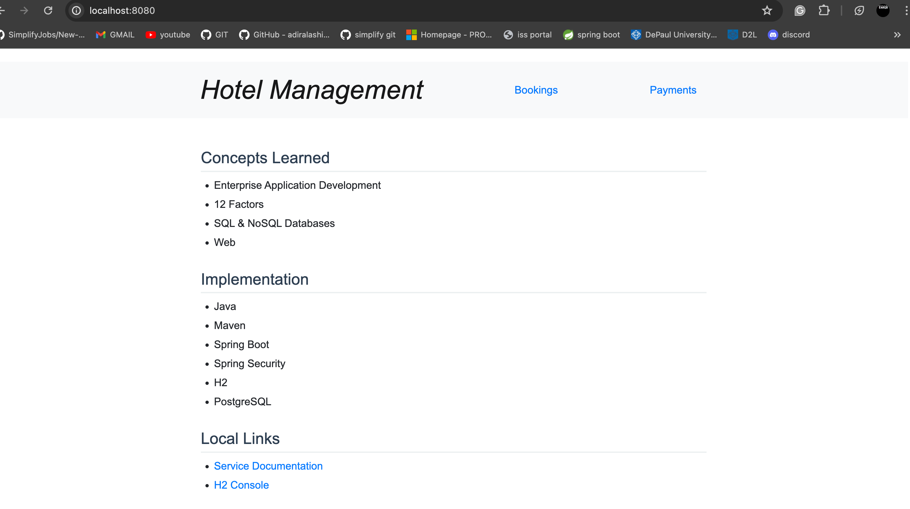

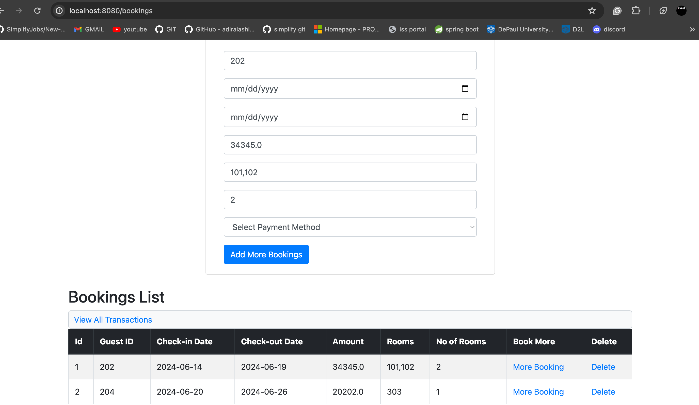

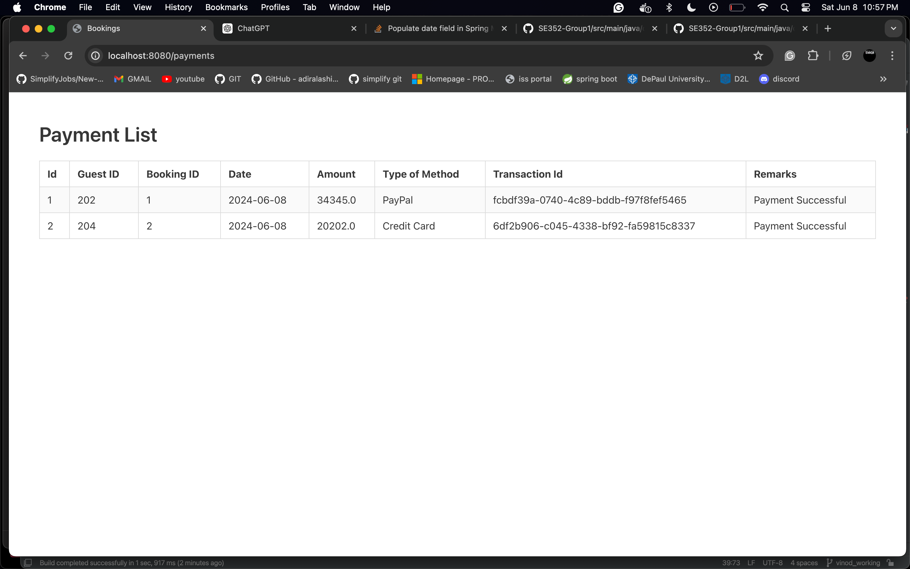

